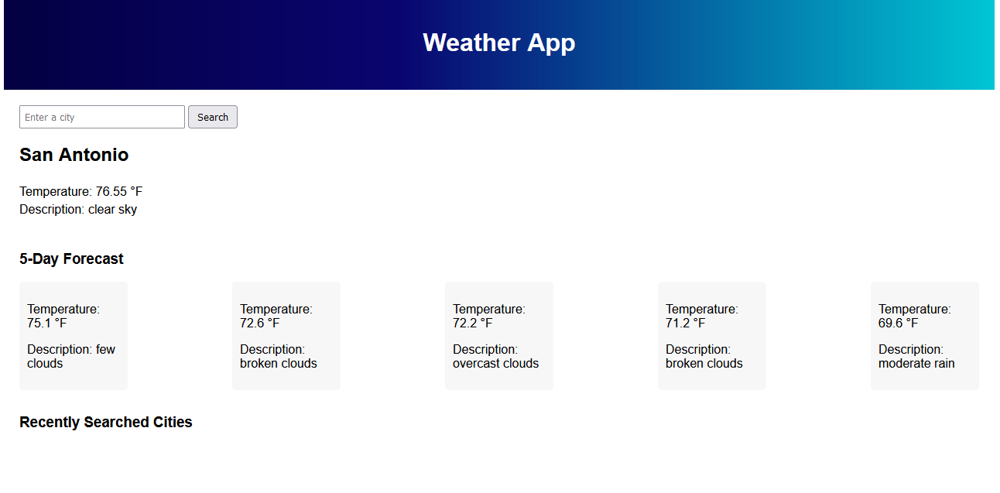

# Weather App

## Description

A repository for a weather site built from HTML, CSS, and JavaScript using the OpenWeatherMap API.

I was challenged with creating a site to provide weather info using the OpenWeatherMap API. It needed to display current weather, a 5-day forecast, and display recently searched cities on the page for quick access. I was able to get the current weather and forecast to work correctly, but have struggled to get the recently searched cities to display properly from local storage.

## Credits

During this project I consulted with tutoring staff at the UTSA Coding Boot Camp.

## License

Please refer to the license in the repo.